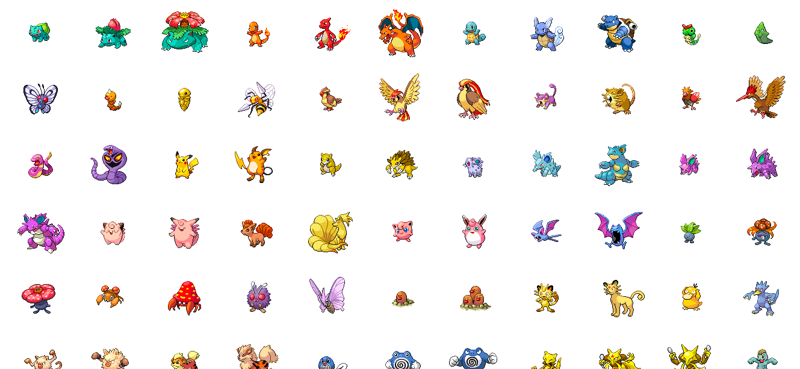
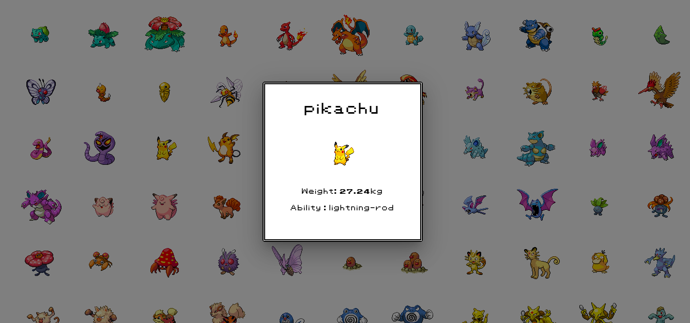

# Pokedex project

This project follows [this React tutorial from Theodo](https://github.com/theodo/formation-dev/blob/master/react/react.md/). A Redux and Saga logic was then added.

It shows the complete pokedex of Gen 1 Pokemon. Click on the sprite to display name, sprite, weight and first ability.

## Installation
Clone this git and in the git directory, run `npm install`.

You need to [download node.js](https://www.npmjs.com/get-npm) 
to use the npm command if you don't have it already

## Run
On the project directory, run `npm start`. It will open a localhost web page on your browser.